**GESTIÓN DE CONSULTA**

Responder preguntas, aclarar dudas, gestionar solicitudes de información de producto.

**Cada integrante de Cx tiene a cargo un grupo de clientes** de los cuales oficia de “ ejecutivo de cuentas “, siendo responsables del seguimiento durante el mes de resolver consultas y dudas, detectar diferencias/ problemas que afecten a uno o más de los clientes a cargo, comunicar cambios, mejoras o peticiones de cambios de conexión y/o contraseñas , gestionar reuniones, capacitaciones y vinculaciones de nuevos medios de pagos.

También tendrá a cargo el **seguimiento de la gestión de tickets de cada usuario y posterior comunicación una vez resuelto el mismo.**

Será **responsabilidad** de Cx mantener actualizados los manuales de uso de las diferentes plataformas de consultas, como también de desarrollar manuales de nuevas plataformas que se incorporen y de mantener permanente comunicación con el equipo de desarrollo y tecnología para mantenerse informado de los cambios en el producto y para informar cambios de comportamiento que se detecten en las procesadoras de pago.

El equipo de Cx determina cada trimestre un listado de grandes cuentas que deben tener un seguimiento periodico y que se toman de referencia para evaluar los problemas recurrentes de uso, problemas recurrentes de conexión , problemas recurrentes de diferencias por plataformas.

**Puesta en marcha **

Tenemos dos opciones CON o SIN IMPLEMENTACIÓN.

**Plan** que se le asigna a los clientes de cada país cuando se dan las altas de clientes:

- *Argentina:* Siempre son Cash Delivery 

- *Uruguay:* Siempre son Cash Comercio SALVO que tenga Peya y/o Rappi, entonces es Cash Delivery 

<!-- -->

- **Sin implementación**

**Cuando ingrese un nuevo cliente y el equipo comercial considere de pocas sucursales o transacciones, se enviará un mail al líder de CX bajo el título PUESTA EN MARCHA. **

Éste derivará el mismo al equipo para comenzar el proceso de vinculación que se realizará <u>entre el cliente, vendedor e integrante de cx.</u>

Una vez realizada la **vinculación**, se coordinará una próxima reunión de **capacitación** en la que se hará un repaso por todas las funcionalidades del producto y donde el usuario tendrá espacio para plantear dudas. Luego el cliente tendrá los canales habituales de consulta vía mail o wapp.

**Nuevo Cliente** -\> **TRATO GANADO**

<u>Aclaración</u>: *cuando un cliente entra en **período de prueba** (trial/período de prueba de 7 días) los vendedores le crean una cuenta en nubceo, y esa cuenta en nubceo está asociada a la plataforma Pipe, por lo que automáticamente se crea un nuevo trato, pero el mismo **NO ESTÁ GANADO.***

1. Cuando el cliente decide contratar nubceo, el vendedor se dirige a la plataforma de Pipe y lo convierte en GANADO.

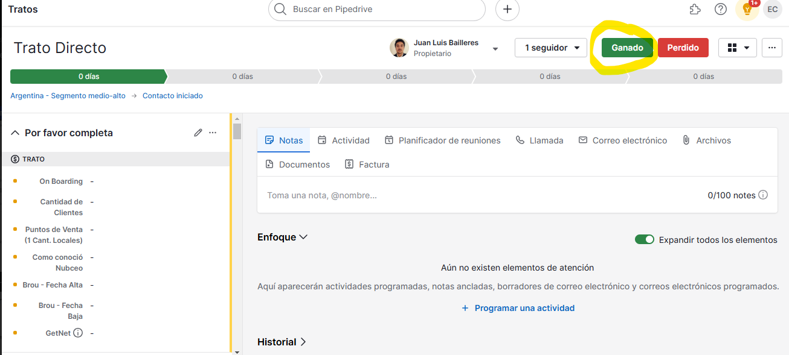

1. Una vez que ese cliente pasa a estar ganado, nos va a llegar este mail que dice TRATO GANADO y con un número de tenant asignado

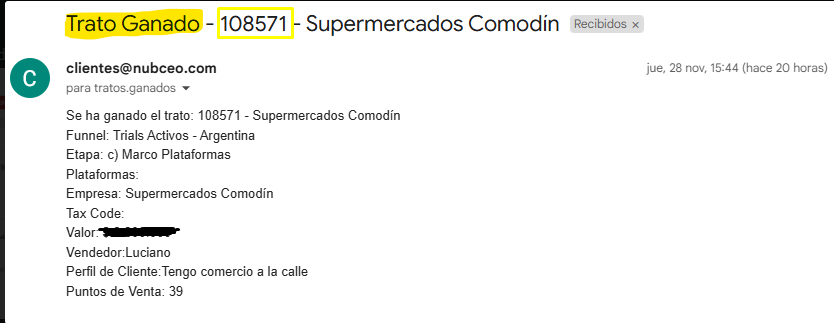

**¡Importante!** NO confundir con este correo de *NUEVO TRATO, ya que este correo es el que llega cuando el cliente se registra en Nubceo o el vendedor crea el trato en la plataforma Pipe.*

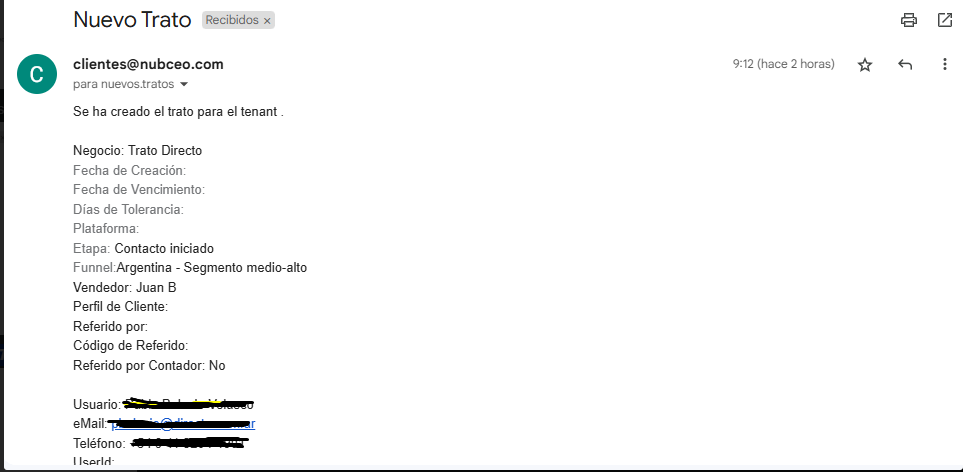

1. Una vez que tenemos el *trato ganado* y tenemos el *número de Tenant*, nos dirigiremos a la plataforma de **Admin** para activar esa cuenta

Acciones **\>** suscribir o cambiar plan **\>** ponemos el Tenant **\>** aplicamos el plan que corresponda a cada país (el plan que le corresponde a cada país ya está pineado en el chat) **\>** ponemos actualizar y listo.

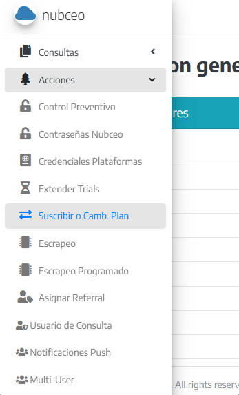

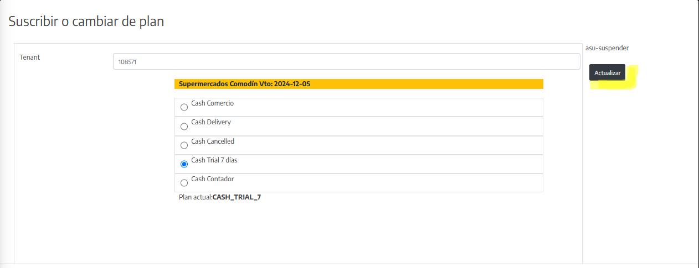

Para dar de **BAJA** es exactamente lo mismo el procedimiento de Admin. 

Una vez que tenemos el OK de Castosa, nos dirigimos al

Admin **\>** acciones **\>** suscribir o cambiar plan **\>** ponemos el Tenant **\>** Aplican **CASH CANCELLED** y listo.

¡Buen día! 

Envío la siguiente solicitud de baja

Tenant:

Cliente: 

País: Argentina 

Plan: Local: 

Última factura: Deuda pendiente: 

Fecha de ganado: 

Fecha de solicitud de Baja:

 Vendedor: 

Motivo: 

Observaciones: 

Contacto (Nombre y teléfono): 

Mail: 

¡Saludos!

- **Con implementación**

**Cuando ingrese un nuevo cliente y el equipo comercial haya cobrado el servicio de implementación, se enviará un mail al líder de CX bajo el título IMPLEMENTACIÓN.**

Éste derivará el mismo al implementador externo, quien comenzara el proceso de OnBoarding coordinando las distintas reuniones con el cliente y el vendedor; en un inicio, se acordará entre las partes y de acuerdo a las necesidades del cliente, los días y horarios en los que se realizaran la vinculación y las dos etapas de capacitación. 

Para dicho proceso se abre una agenda, que será monitoreada por el implementador.

<u>EJEMPLO DE CORREO,</u>, luego de tener una primera reunión en donde se le consulta al cliente que procesadoras desean vincular.

Buenas tardes XXX,

¡Espero que se encuentren muy bien!

Cómo conversamos previamente en la reunión, procedo a compartirles la información que deben de solicitar a cada plataforma para la posterior vinculación.

**FISERV**: ( Ya solicitado a la ejecutiva de cuenta) Deben indicarle a la procesadora que desean recibir la información de su cuenta mediante el SFTP o SFG. Para esto, deberán pedirles que les envíen los siguientes datos:

- USUARIO (diferente al del portal)

- CONTRASEÑA (diferente al del portal)

- ARCHIVO PPK

Una vez que les envíen el correo con usuario, contraseña y archivo PPK adjunto, nos lo reenvían al correo de team.cx@nubceo.com y nosotros procedemos con la vinculación.

**PAYWAY/PRISMA:** se requiere

- USUARIO 

- CONTRASEÑA 

**MERCADO PAGO:** se requiere

- USUARIO 

- CONTRASEÑA 

**AMEX**: En cuanto a la conexión por SFTP de AMEX, tienen que contactarse vía mail con la procesadora, o si poseen ejecutivo de cuentas pueden solicitarlo el acceso a conexión SFTP, versión GRRCN 4. con copia a team.cx@nubceo.com

La procesadora misma les enviará usuario y contraseña.

También les solicitarán completar un formulario para poder brindarles el SFTP, del que les dejo algunas instrucciones a la hora de completarlo, ya que piden información que debemos brindarles nosotros.

- Empresa conciliadora: Colocar OTROS (nubceo).

- Formato de archivo: Marcar TAB.

- Protocolo de comunicación: Marcar SFTP, GRRNC 4.0

Una vez completado y enviado el formulario a la procesadora, ellos les harán llegar los datos de acceso al SFTP.

Les dejo el mail de contacto de AMEX: servicioaclientesamex@aexp.com 

**NARANJA:** Deberías indicarle a Naranja que deseas recibir los archivos por medio de STA en este portal <https://secure.tarjetanaranja.com.ar/sta/cgi-bin/sta.cgi?session-task=30> , y ellos te van a brindar las credenciales necesarias para acceder al STA.

También deben solicitarle que les guarden los archivos de conciliaciones, los cuales se van a disponibilizar en archivos CSV.

---

Por otro lado les informo en qué consiste el proceso de implementación, el mismo está compuesto por dos instancias:

**La primera es la vinculación**: En esta instancia, nos reunimos en una videollamada de aproximadamente 30 minutos, donde creamos la razón social y vinculamos las procesadoras de pago. Para esta reunión, es importante que tengan a mano todas las claves de acceso de las plataformas que utilizan. No es necesario que todos los usuarios que vayan a utilizar Nubceo estén presentes en este encuentro, basta con que participe la persona encargada de gestionar los medios de pago y tenga acceso a estos.

**La segunda es la capacitación:** En esta instancia, hacemos un recorrido completo por la plataforma y revisaremos los reportes de excel qué tenemos disponibles. Para esta reunión, si es necesario que asistan todos los usuarios que utilizarán la plataforma. Recomendamos realizar las reuniones por separado para evitar sobrecargarles con demasiada información en un solo día.

Les comparto mi disponibilidad de esta semana y la próxima semana para poder agendar ambas reuniones:

Lunes 11 am / 12 pm

Martes 11am /12 pm

Quedo a la espera de su respuesta.

Saludos cordiales,

**Procedimiento**

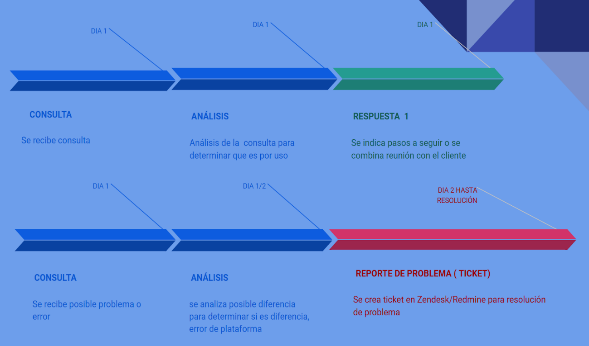

<u>Control de liquidaciones- Ventas- Impuestos y Comisiones</u>

El control preventivo de datos consta de algunos paso que hay que cumplir , teniendo en cuenta que 1 no es excluyente del otro:

**Paso 1:** **CONTROL NUBCEO VS NUBCEO**

Ingresamos a la cuenta espejo del cliente con usuario y contraseña.

Nos dirigimos a la pestaña de LIQUIDACIONES y luego hacemos click en VER FILTROS.

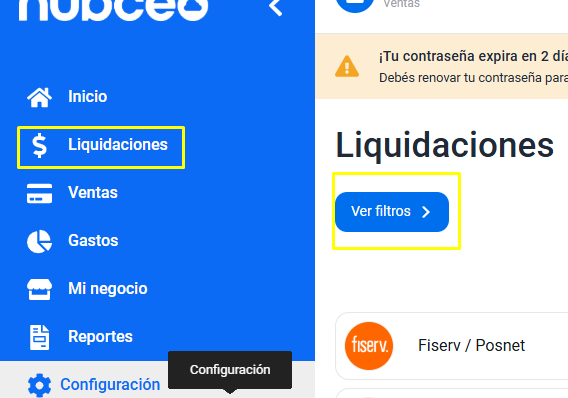

Luego elegimos la PLATAFORMA analizar, el PERÍODO DE FECHA y hacemos click en *aplicar filtros*.

Seleccionamos DESCARGAR EXCEL y elegimos la opción INCLUIR VENTAS.

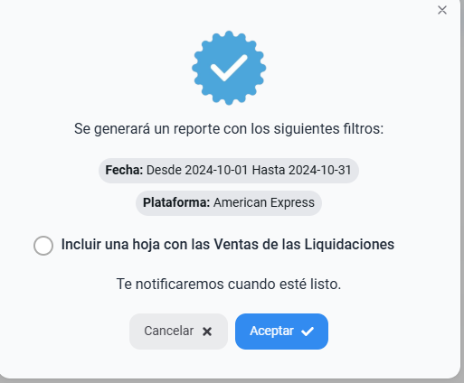

Luego nos dirigimos a la pestaña REPORTES --\> SOLICITUDES

Cuando se complete la descarga, podremos descargar el EXCEL y comenzaremos con el análisis de datos.

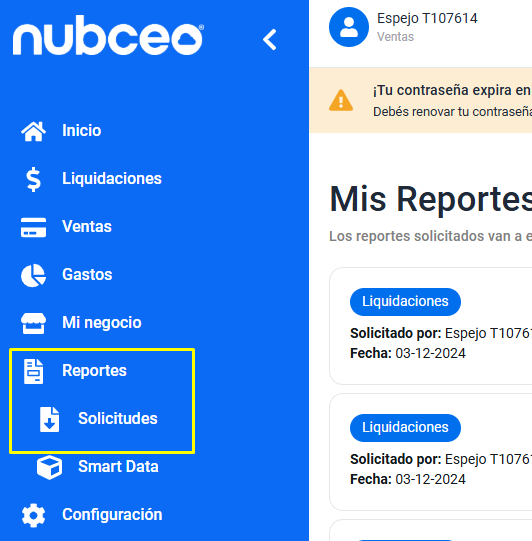

1. Descargamos excel, aplicamos la **macro:**

<!-- -->

1. Click en programador

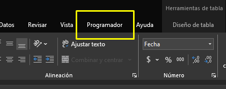

1. Click en Visual basic

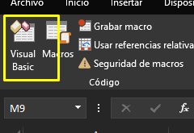

1. Click en Archivo -\> Importar archivo (previamente descargado el archivo de macro, solicitar el mismo)

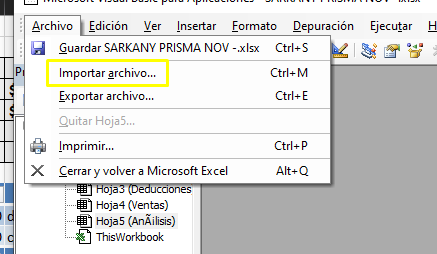

1. Click en ejecutar macro

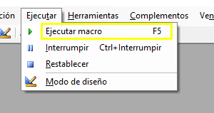

1. Se nos abrirá una pestaña llamada *Análisis* que nos brindará una primera impresión sobre la problemática o no, que debemos abordar.

<!-- -->

2. Luego ya en el EXCEL, en la solapa LIQUIDACIONES, agregamos una columna para comprobar que:

* Bruto - Impuestos- Descuentos - Neto = Cero*

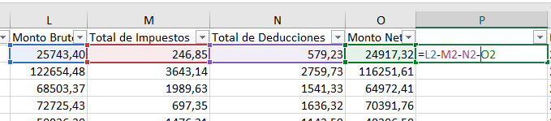

3. Luego debemos, **sumar la columna Monto Bruto de la solapa de liquidaciones y comparar con el Monto Bruto de la solapa ventas**, para verificar que el valor sea el mismo.

<!-- -->

4. Realizar la misma comprobación de **montos de impuestos y deducciones y de montos netos**, si se descargo la solapa de cobros ( esto no sucede con todas las plataformas).

- En el caso de que coincidan todos los montos, **el control de Nubceo vs Nubceo quedara ok .**

<!-- -->

- **De no coincidir uno o varios montos se deberá investigar los motivos de dichas diferencias.**

Por ejemplo faltante de ventas , de contracargos/ devoluciones, ventas o impuestos duplicados, diferencias de signos, etc..

Para ellos se deberá, por un lado identificar la o las liquidaciones con diferencias para luego buscar en la plataforma correspondiente el archivo que nos indique cual es el motivo de dicha faltante o diferencia.

Para esto abrimos otra solapa en el mismo excel y realizaremos una tabla dinámica en donde comparemos (ID Liquidación y Monto Bruto de la solapa liquidación contra Liquidación ID y Monto Bruto de la solapa ventas)

Luego <u>restamos monto bruto de liquidaciones contra monto bruto de ventas</u>, si la LIQUIDACIÓN corresponde a esa VENTA el valor será CERO, de lo contrario NO se podrá restar y la marcaremos con color.

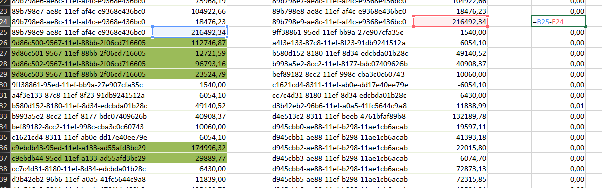

El próximo paso será verificar el NÚMERO DE LIQUIDACIÓN en la pestaña liquidación y ventas por medio de los filtros y podemos observar por ejemplo si una liquidación no posee venta:

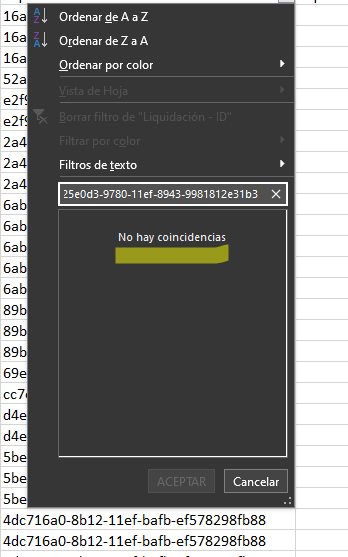

**Ejemplo de control 1 Nubceo vs Nubceo**

<u>LIQUIDACIONES</u>

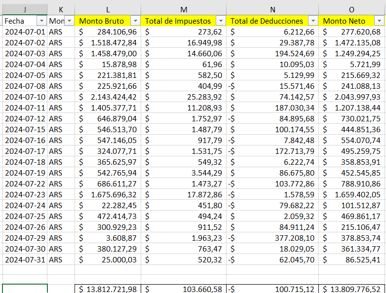

<u>VENTAS</u>

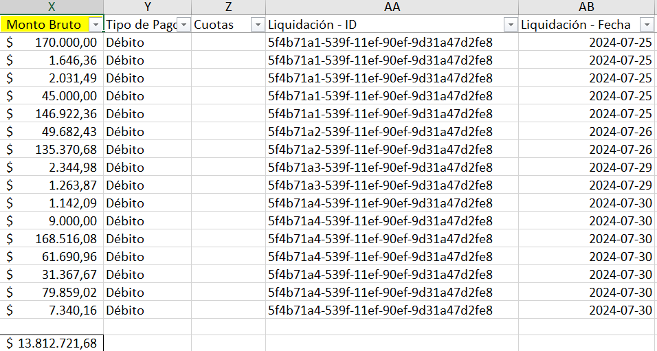

**Paso 2:** **CONTROL NUBCEO VS PLATAFORMAS DE PAGO**

Ir a solapa PROCESADORAS DE PAGO, allí hay información detallada de cada una.

**Paso 3:** **SINCRONIZAR **

Una vez realizados los controles de nubceo vs nubceo y nubceo vs plataforma, **de haber encontrado diferencias,** por ejemplo de cantidad de liquidaciones, cantidad de ventas, diferencias de signos, etc, se podrá realizar sincronización desde Admin Panel. 

Se debe ingresar el número de Tenant, seleccionar la plataforma según la pec que corresponda y luego el periodo a sincronizar.

**MUY IMPORTANTE:** según cada plataforma, se debe colocar un periodo corto de sync según fecha de liquidación, pero en otros casos según fecha de ventas. 

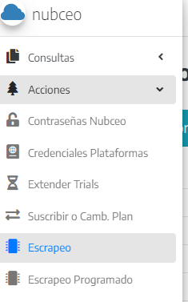

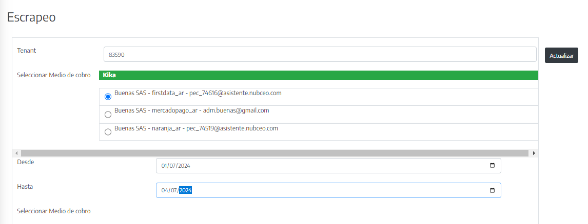

**Paso 4:** **REALIZAR REPORTE**

En cualquier caso que se comprobara que existen diferencias y se obtengan las pruebas, se deberá registrar las mismas a través de Zendesk y Redmine para enviar el ticket a QA/tecnología para su posterior análisis y corrección.

Para zendesk se utiliza un usuario común al equipo de CX y para Redmine, cada integrante lo hará con su usuario y contraseña. (VER SOLAPA PLATAFORMAS).

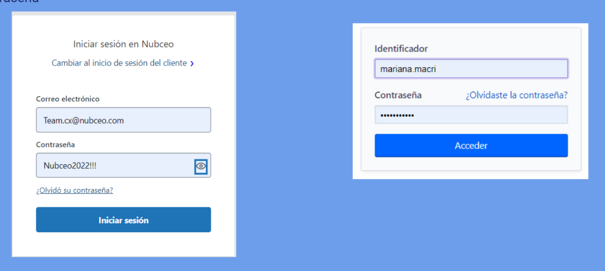

1. **Como armar reporte en Zendesk**

Una vez que ingresamos a la plataforma, debemos armar el ticket en Zendesk.

Esto se hace en dos pasos ya que solo Redmaine nos permite adjuntar imágenes y archivos.

<u>Datos a completar sobre el margen izquierdo</u>

**Solicitante:** colocar el Número de T y elegir uno de los contactos que figuran al desplegarse ( es igual elegir cualquiera) 

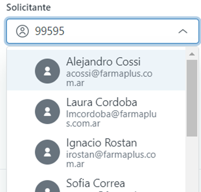

<u>Agente Asignado</u>

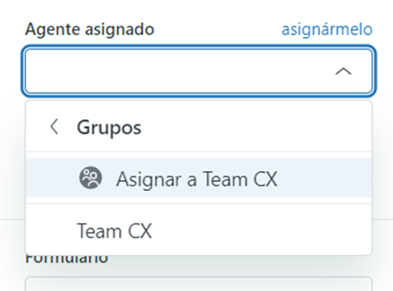

<u>Prioridad y Número de Tenant</u>: en prioridad se coloca la opción que corresponda de acuerdo a la urgencia de resolución del problema. En Tipo **siempre ponemos PROBLEMA.**



<u>From Customer</u>: se tilda si el cliente está haciendo algún tipo de reclamo



<u>Plataforma</u>: elegir la plataforma que se está reportando



<u>Reportado por</u>: elegir la opción que corresponde. Por lo general cuando es Control preventivo se coloca Team CX, pero si es From Customer se coloca Cliente

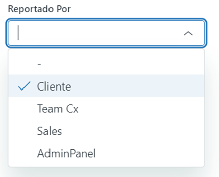

<u>País</u>: seleccionar el país al que pertenece el Tenant.



<u>Estado en Redmine:</u> siempre tildar NEW porque de lo contrario no viajará el ticket a Redmine.

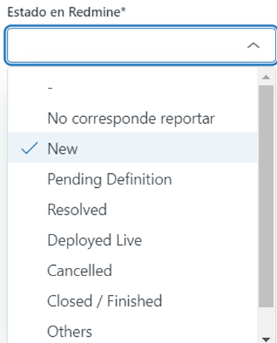

<u>Usuario:</u> seleccionar el nombre de quien reporta

<u>Modelo de título</u>

**NUMERO DE PEC- PROBLEMA - PLATAFORMA**

**ATENCIÓN!!** <u>SIEMPRE</u> COLOCAR NOTA INTERNA, de lo contrario se le enviará el reporte de error al cliente.



**A continuación se copia el reporte respetando la plantilla y asegurándose de completar todos los datos que solicita.**

Por último enviar como <u>EN ESPERA</u> para que envíe el ticket a Redmine , de lo contrario no migrara.



2. **Plantilla de Reporte de Zendesk**

En el recuadro de NOTA INTERNA, utilizamos la siguiente plantilla a completar.

**Descripción**: 

- **Período analizado/reportado**: 

- **Información contra la que se comparó:**.

- **Horario/fecha de revisión:** 

- **Pec/Empresa**: 

- **Evidencia (nubceo vs portal, archivo y capturas) / ID's útiles:**

3. **Modelo de mail**

Al enviar el mail se debe **obligatoriamente** completar los datos de la plantilla, especificando cual es el error que se encuentra, el periodo, el número de PEC sobre la que se detecta el error.

En este punto MUY IMPORTANTE no saltear el dato y **NO CONFUNDIR el número de PEC con el Número de Tenant. **

<u>EJEMPLO DE REPORTE CORRECTO</u>

**Descripción**: Se descarga el excel de liquidaciones de Nubceo, al comparar el monto bruto de liquidaciones contra el monto bruto se encuentran diferencias. 

Las diferencias encontradas se deben a que hay liquidaciones que no traen ventas y otras que tienen ventas pero no traen todas. 

*Monto bruto liquidaciones* --\> \$1.194.502.759,17

*Monto bruto ventas* --\> \$1.128.122.731,97

*Diferencia entre montos* --\> \$66.380.027,2

- **Período analizado/reportado**: 27/01 - 06/02 

- **Información contra la que se comparó:** Excel de liquidaciones de Nubceo, solapa de liquidaciones contra la solapa de ventas.

- **Horario/fecha de revisión:** 15/02/2024 17:30 Hs

- **Pec/Empresa**: 97582 (Número de T 99595)

- **Evidencia (nubceo vs portal, archivo y capturas) / ID's útiles:**

Se adjunta excel de liquidaciones de Nubceo con una solapa nombrada "Tablas Dinámicas" en la cual se encuentran dos tablas dinámicas que comparan el monto bruto de liquidaciones contra el monto bruto de las ventas. A la derecha de ambas tablas se encuentran dos cuadros. Uno de ellos rejunta todas las liquidaciones que tienen diferencias y el otro rejunta todas las liquidaciones que no traen ventas. 

Se adjuntan comprobantes de pago de ejemplo 

Se adjuntan capturas de pantalla 

4. **Cómo adjuntar archivos desde Redmine**

Una vez realizado los pasos en Zendesk, **se pasará a buscar el ticket en REDMINE**, desde donde podremos modificarlo y así agregar imágenes y archivos de prueba del problema reportado.

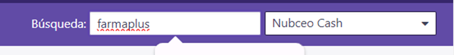

Al tocar en el Support que cargamos en Zendesk, nos va a abrir el ticket para que podamos agregar archivos e imágenes; para eso hay que clickear en **Modificar**

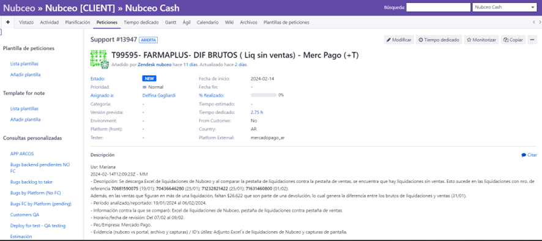

Si bajamos nos va a aparecer este recuadro para agregar algo de información y abajo la opción agregar archivo.

Una vez que agregamos los archivos de prueba vamos a colocar aceptar y ya queda el Support disponible para que lo analicen en tecnología.

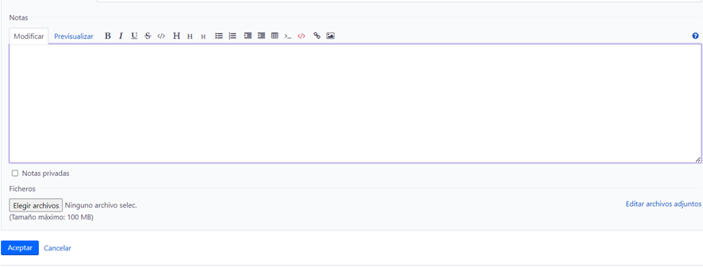

<u>PUNTOS A COMPLETAR EN REDMINE AL CARGAR UN SUPPORT</u>

Cargar sin excepción: 

1. Asignarse el Sup en donde dice **Asignado a ;** a partir de ahora cada uno que cargue un supp deberá asignarse el mismo para poder recibir las notificaciones cuando haya algún cambio 

2. Deben cargar la **Versión Prevista** : la misma irá acorde a la versión de Sprint que esté en curso al momento de cargar el supp

3. Marcar en caso de que sea **From Customer o From Preventive Analysis**.

4. Registrar el **Tiempo dedicado** al análisis que ocasionó ese supp

5. Cargar el número de **Tenant** en el casillero destinado a este fin , al margen de que el número de T figure en el título

6. En la sección **Bug** siempre debemos dejar NO

- 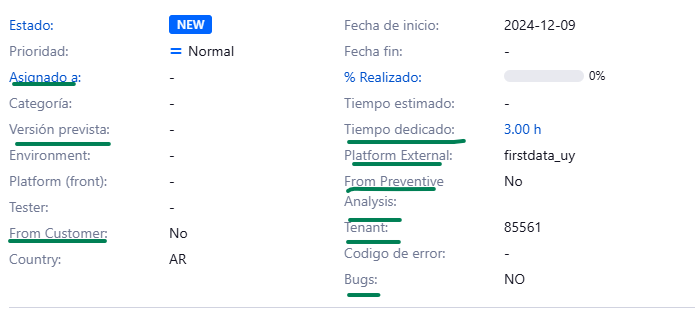

-

---

### OCR de imágenes

> **OCR:**
>
> Tratos
> 
> Q Buscar en Pipedrive +
> ; Juan Luis Bailleres i "
> 
> Trato Directo g Propietario - 1seguidor » Ganado | Perdido
> 
> día O dias 0 días O días
> ‘Argentina - Segmento medio-alto > Contacto iniciado
> 7 Por favor completa 0-
> 
> P E Notas G Actividad — E Planificador de reuniones © Llamada © Correo electrónico — Y Archivos
> 
> TRATO
> o ® Documentos — E Factura
> e OnBoarding -
> Toma una nota, @nombre... 0/100 notes
> 
> e — Cantidad de - . e r o
> 
> Clientes
> 
> © Puntos de Venta -
> 
> (1 Cant. Locales) Enfoque Y
> 
> * Comoconoció -
> Nubceo
> 
> * Brou-Fecha Alta -
> * Brou-Fecha -
> Baja
> 
> - Getnet® -
> Historial >
> 
> Aún no existen elementos de atención
> 
> + Programar una actividad
> 
> ©) Expandir todos los elementos
> 
> Aqui aparecerán actividades programadas, notas ancladas, borradores de correo electrónico y correos electrónicos programados.

> **OCR:**
>
> Herramientas de tabla
> 
> Datos — Revisar Vista] Programador - |Ayuda — Diseño de tabla
> 
> D- | Y ajutarieto = E
> 
> $ - % 4 4
> 
> Alineación 5 Numero 5

> **OCR:**
>
> FACO — MICIO -- MSEMar ISP Os!
> 
> 2 Grabar macro
> 
> Usar referencias relativa
> 
> d S eoe
> 
> Código
> 
> Mg - | fe

> **OCR:**
>
> Archivo | Edición Ver _Insertar _Eormato — Depuración — Ejecutar -H
> Ul Guardar SARKANY PRISMANOV-xisx CtrleS — z| Se q y
> Importar archivo. CtrleM
> 
> Exportar archivo.
> 
> Quitar Hojas
> Imprimir
> 
> Cerrar y volver a Microsoft Excel Altea
> 
> Hoja4 (Ventas)
> Hojas (AnAilisis)
> E ThsWorkbook

> **OCR:**
>
> Ejecutar | Herramientas _ Complementos Ven
> » | Ejecutar macro Fs
> b Interrumpir - Ctrl+interrumpir
> 
> Restablecer
> 
> Z Modo de diseño

> **OCR:**
>
> N o P
> 
> L M
> 
> - |Monto Brut - |Total de Impuestos |~ |Total de Deducciones [- |Monto Ne{~ .
> | 25743,40| 246,851, 57923| _ 24917,32|:
> 122654,48 3643,14 2759,73 116251,61
> 68503,37 1989,63 154133 — 64972,41
> 
> 1636,32 — 70391,76
> 
> 72725,43 697,35

> **OCR:**
>
> 9791 7959-EEOC - E6| TE7 9059
> 89b798e7-ae8c-11ef-af4c-e9368e436bc0
> 89b798e8-ae8c-11ef-af4c-e9368e436bc0
> 89b798e9-ae8c-11ef-af4c-e9368e436bc0
> 
> 9ff38861-95ed-11ef-bb9a-27e907cfa35c
> 
> a4f3e133-87c8-11ef-8f23-91db9241512a
> b580d152-8180-11ef-8d34-edcbda01b28c
> b993a5e2-Bcc2-11ef-8177-bdc07409626b
> bef89182-8cc2-11ef-998c-cba3c0c60743
> |c1621cd4-8311-11ef-ab0e-dd17e40ee79%e
> 
> cc7c4d31-8180-11ef-8d34-edchda01b28c
> |d3b42eb2-96b6-11ef-a0a5-41fc5644c9a8
> 
> 1540,00
> 
> 6054,10
> 49140,52
> 40908,37
> 10060,00
> -6054,10
> 
> 97 ue een eee
> 89b798e8-ae8c-11ef-afdc-e9368e436bc0
> 89b798e9-ae8c-11ef-afdc-e9368e436bc0
> 9ff38861-95ed-11ef-bb9a-27e907cfa35c
> 
> adf3el33-87c8-11ef-8f23-91db9241512a
> 
> b580d152-8180-11ef-8d34-edcbda01b28c
> b993a5e2-Bcc2-11ef-8177-bdc07409626b
> bef89182-8cc2-11ef-998c-cba3c0c60743
> 
> c1621cd4-8311-11ef-ab0e-dd17e40ee79%e
> cc7c4d31-8180-11ef- 8d34-edcbda01b28c
> d3b42eb2-96b6-11ef-a0a5-41fc5644c9a8
> d4es13c2-8311-11ef-beeb-4761bfaf89b8
> 
> d945cbb0-ae88-11ef-b298-11ae1ch6acab
> d945cbb1-ae88-11ef-b298-11ae1ch6acab
> d945cbb2-ae88-11ef-b298-11ae1ch6acab
> d945cbb3-ae88-11ef-b298-11ae1ch6acab
> d945cbb4-ae88-11ef-b298-11ae1ch6acab
> d945cbb5-ae88-11ef-b298-11ae1ch6acab
> 
> —
> 
> 18476,23,
> 
> —
> 
> 21649234|
> 
> [=825-E24
> 
> 1540,00
> 6054,10
> 49140,52
> 40908,37
> 10060,00
> -6054,10
> 6430,00
> 11838,99
> 132189,78
> 19597,11
> 41393,18
> 22015,80
> 6074,70
> 72873,13
> 72315,85
> 
> 0,01

> **OCR:**
>
> *l Ordenar de AaZ
> “l OrdenardeZaA
> 
> Ordenar por color
> 
> Filtros de texto »
> 
> 25e0d3-9780-11ef-8943-9981812631b3_X
> 
> No hay coincidencias
> 
> Cancelar
> 
> Adc716a0-8b12-11ef-bafb-ef578298fb88

> **OCR:**
>
> J K L M N o
> 
> Fecha — - Mon- MontoBruto ~ Total de mpuestos - TotaldeDeducciones - MontoNeto -
> 
> 2024-07-01 ARS $ 284.10696 $ 273,62 $ 6.212,66 $ — 277.620,68
> 2024-07-02 ARS $ 1.518.472,84 $ 16.949,98 $ 29.387,78 $ 1.472.135,08
> 2024-07-03 ARS $ 1.458.479,00 $ 14.660,06 $ 194.524,69 $ 1.249.294,25
> 2024-07-04 ARS — $ 15.878,98 $ 6196 $ 10.095,03 $ 5.721,99
> 2024-07-05 ARS $ 22138181 $ 582,50 $ 5.12999 $ — 215.669,32
> 2024-07-08 ARS $ 225.92166 $ 404,99 $ 15.571,46 $ — 241.088,13
> 2024-07-10 ARS $ 2.143.424,42 $ 25.283,92 $ 74.142,57 $ 2.043.997,93
> 2024-07-11 ARS $ 1.405.377,71 $ 11.208,93 $ 187.030,34 $ 1.207.138,44
> 2024-07-12 ARS $ 646.879,04 $ 1.752,97 $ 84.895,68 $ — 730.021,75
> 2024-07-15 ARS $ 546.513,70 $ 1.487,79 $ 100.174,55 $ — 444.851,36
> 2024-07-16 ARS $ 547.146,05 $ 917,79 $ 7.842,48 $ — 554.070,74
> 2024-07-17 ARS $ 324.077,71 $ 1531,75 $ 172.713,79 $ — 495.259,75
> 2024-07-18 ARS $ 365.625,97 $ 549,32 $ 6.222,74 $ 358.853,91
> 2024-07-19 ARS $ 542.765,94 $ 3.544,29 $ 86.675,80 $ — 452.545,85
> 2024-07-22 ARS $ 686.61127 $ 1.473,27 $ 103.772,86 $ 788.910,86
> 2024-07-23 ARS $ 1.675.696,32 $ 17.872,86 $ 1.578,59 $ 1.659.402,05
> 2024-07-24 ARS — $ 22.282,45 $ 451,80 $ 79.66222 $ — 101.512,87
> 2024-07-25 ARS $ 472.414,73 $ 494,24 $ 2.059,32 $ — 469.861,17
> 2024-07-26 ARS $ 300.92923 $ 911,52 $ 84.91124 $ 215.106,47
> 2024-07-29 ARS $ 3.608,87 $ 1.963,23 -$ 377.208,10 $ — 378.853,74
> 2024-07-30 ARS $ 380.127,29 $ 763,47 $ 18.029,05 $ — 361.334,77
> 2024-07-31 ARS $ 25.000,03 $ 520,32 $ 62.045,70 $ 86.525,41
> 
> ] [S 13.31272198 1$ 103.660,58 |-S 100.715,12 | $ 13.809.776,52 |

> **OCR:**
>
> xX Y
> “Monto Bruto |- |Tipo de Pagd - |Cuot
> S$ — 170.000,00 Débito
> $ 1.646,36 Débito
> $ 2.031,49 Débito
> $ — 45.000,00 Débito
> $ — 146.922,36 Débito
> $ — 49.682,43 Débito
> $ 135.370,68 Débito
> $ 2.344,98 Débito
> $ 1.263,87 Débito
> $ 1.142,09 Débito
> $ 9.000,00 Débito
> $ 168.516,08 Débito
> $ — 61.690,96 Débito
> $ 31.367,67 Débito
> $ — 79.859,02 Débito
> $ 7.340,16 Débito
> 
> $ 13.81
> 
> 1,68
> 
> Z
> as
> 
> AA
> - Liquidación - 1D
> 5f4b71a1-539f-11ef-90ef-9d31a47d2fe8
> 5f4b71a1-539f-11ef-90ef-9d31a47d2fe8
> 5f4b71a1-539f-11ef-90ef-9d31a47d2fe8
> 5f4b71a1-539f-11ef-90ef-9d31a47d2fe8
> 5f4b71a1-539f-11ef-90ef-9d31a47d2fe8
> 5f4b71a2-539f-11ef-90ef-9d31a47d2fe8
> 5f4b71a2-539f-11ef-90ef-9d31a47d2fe8
> 5f4b71a3-539f-11ef-90ef-9d31a47d2fe8
> 5f4b71a3-539f-11ef-90ef-9d31a47d2fe8
> 5f4b71a4-539f-11ef-90ef-9d31a47d2fe8
> 5f4b71a4-539f-11ef-90ef-9d31a47d2fe8
> 5f4b71a4-539f-11ef-90ef-9d31a47d2fe8
> 5f4b71a4-539f-11ef-90ef-9d31a47d2fe8
> 5f4b71a4-539f-11ef-90ef-9d31a47d2fe8
> 5f4b71a4-539f-11ef-90ef-9d31a47d2fe8
> 5f4b71a4-539f-11ef-90ef-9d31a47d2fe8
> 
> - |Liquidacién - Fecha [-
> 2024-07-25
> 2024-07-25
> 2024-07-25
> 2024-07-25
> 2024-07-25
> 2024-07-26
> 2024-07-26
> 2024-07-29
> 2024-07-29
> 2024-07-30
> 2024-07-30
> 2024-07-30
> 2024-07-30
> 2024-07-30
> 2024-07-30
> 2024-07-30

> **OCR:**
>
> @ nubceo
> 
> Consultas
> 
> Acciones
> 
> Contraseñas Nubceo
> Credenciales Plataformas
> Extender Trials
> 
> Suscribir o Camb. Plan
> 
> Escrapeo
> 
> “ “ 1 I O D» »
> 
> Escrapeo Programado

> **OCR:**
>
> Supermercados Comodin
> 
> clientes@nubceo.com
> 
> Se ha ganado el trato: 108571 - Supermercados Comodín
> Funnel: Trials Activos - Argentina
> 
> Etapa: c) Marco Plataformas
> 
> Plataformas:
> 
> Empresa: Supermercados Comodin
> 
> Tax Code:
> 
> Valor
> 
> Vendedor:Luciano
> 
> Perfil de Cliente:Tengo comercio a la calle
> 
> Puntos de Venta: 39
> 
> Recibidos x
> 
> 18:44 (hace 20 hor

> **OCR:**
>
> Escrapeo
> 
> Tenant p
> 
> Seleconr Medi de b
> q Buenas SAS - fistdata_ar - pec_74616@asistente.nubceo.com
> (© Buenas SAS - mercadopago_ar - admbuenasQgmalcom
> (© Buenas SAS - naranja_ar- pec-7451902sistente nubceo.com
> 
> OOOO lll
> 
> Desde ovyor}2024 o
> 
> Hasta
> 
> Seleccionar Medio de cobro

> **OCR:**
>
> Inici: ó ,
> 
> iciar sesión en Nubceo Identificador
> Cambiar al inicio de sesión del cliente - -
> 
> mariana.macri
> 
> Correo electrénico Contrasefia
> 
> | Team.cx@nubceo.com eee
> 
> Contraseña
> 
> | Nubceo2022!!!
> 
> ¿Olvidó su contraseña?

> **OCR:**
>
> Solicitante
> 
> »
> 
> Alejandro Cossi
> acossi@farmaplus.co
> mar
> 
> Laura Cordoba
> Imcordoba@farmaplu
> s.com.ar
> 
> Ignacio Rostan
> 
> irostan@farmaplus.co
> maar
> 
> Sofia Correa

> **OCR:**
>
> Agente asignado asignármelo
> 
> < Grupos
> 
> (0) Asignar a Team CX
> 
> Team CX
> 
> rormurario

> **OCR:**
>
> Prioridad* Tipo*
> 
> Normal — < Problema <
> 
> Tenantid

> **OCR:**
>
> From Customer

> **OCR:**
>
> Plataforma
> 
> J
> American Expres
> Billetera Santa Fe
> Contabilium
> Fiserv / Posnet
> Fiserv
> MercadoPago
> MercadoPago
> 
> Naranja

> **OCR:**
>
> Reportado Por
> 
> Y Cliente
> Team Cx
> Sales
> 
> AdminPanel

> **OCR:**
>
> Argentina
> 
> Uruguay
> 
> Colombia

> **OCR:**
>
> Estado en Redmine*
> 
> No corresponde reportar
> Y New
> Pending Definition
> Resolved
> Deployed Live
> Cancelled
> Closed / Finished
> Others “

> **OCR:**
>
> Nuevo Trato recibidos x
> 
> clientes@nubceo.com
> para nuevostratos »
> 
> Se ha creado el trato para el tenant
> 
> Negocio: Trato Directo
> Fecha de Creacién’
> 
> Fecha de Vencimiento:
> 
> Días de Tolerancia
> 
> Plataforma
> 
> Etapa: Contacto iniciado
> 
> Funnel Argentina - Segmento medio-alto
> Vendedor: Juan B
> 
> Perfil de Cliente
> 
> Referido por:
> 
> Código de Referido
> 
> Referido por Contador: No
> 
> Usuario: En
> E -aminainast
> Teléfono: aua
> 
> Leer
> 
> 9:12 (hace 2 horas)
> 
> a z
> 
> X

> **OCR:**
>
> Respuesta pública
> 
> Y © Nota interna
> 
> © Nota interna -

> **OCR:**
>
> ® Nuevo
> @ Abierto
> M Pendiente
> 
> M Enespera
> 
> B Resuelto

> **OCR:**
>
> ]
> 
> Nubceo » Nubceo [CLIENT] » Nubceo Cash
> 
> + ease Amides fein Bros - Tampo cco Git Ag Caled WA) Actos ea d pres
> 
> Planta de petiones
> 
> ts ota
> 
> Template fornote
> 
> splits
> 
> rsa
> 
> Consultas personaladas
> 
> g7
> 
> ur tcig le
> ig y Pc Gg
> Oo f -g
> 
> ‘Support #13947,
> T99595- FARMAPLUS- DIF BRUTOS ( Liq sin ventas) - Merc Pago (+T)
> 
> m rec de een
> peer -
> oc ..
> 
> esp 6 ec aCl gcc de Ne y conga pst de goes sal pea eet secur quay got an s ed en agen cana de
> 
> rer Tm7 1907 O2O ESET ERP 250) NANO V2
> [n yen qu Gn e m de una gin tn $222 qu ton pare e slc c r ec ete sto de ii y 2)
> erode al repera. 19/01/12 22024
> 
> tremacen crags compar: cel e cores d des pasar e iiacnes et ea ees.
> 
> tng Mero Poo
> errs pal ati r /Ol nt ces gan de Nbc cp d prt

> **OCR:**
>
> Notas
> 
> Nodiar| Pevvalzar_ BIUSOHH 4 SRM oO 8B o
> O Nat prvadas
> 
> Fiheros
> 
> [Eegramis] Noguno activo sl tar acivos arts
> 
> (Tomato mixime: 100 )
> 
> =a —

> **OCR:**
>
> Estado:
> Prioridad:
> —
> Categoría:
> 
> Versión prevista:
> 
> Environment
> 
> Platform (front)
> Tester:
> Erom Customer;
> 
> Country:
> 
> No
> AR
> 
> Normal
> 
> Fecha de inicio:
> Fecha fin:
> 
> % Realizado:
> 
> Tiempo estimado:
> 
> Tiempo dedicado:
> 
> Platform External:
> 
> From Preventive
> Analysi
> Tenant
> 
> Codigo de error:
> 
> Bugs:
> 
> 2024-12-09
> 
> 3.00h
> firstdata_uy
> No
> 
> 85561
> 
> NO
> 
> 0%

> **OCR:**
>
> & nubceo
> 
> IB consultas
> 
> & Acciones
> 
> & Control Preventivo
> d Contraseñas Nubceo
> Credenciales Plataformas
> E Extender tials
> 
> = Suscribiro Camb. Plan
> ME Escrapeo
> 
> ME Escrapeo Programado
> e Asignar Referral
> 
> So Usuario de Consulta
> 
> Notificaciones Push
> 
> Multi-User
> 
> n gene
> 
> All rights reser

> **OCR:**
>
> Suscribir o cambiar de plan
> 
> Tenant
> 
> 108571
> 
> Q Cash Comercio
> CO Cash Delivery
> 
> © Cash Cancelled
> @ ash Thal días
> (© Cash Contador
> 
> Plan actual:CASH_TRIAL_7
> 
> asu-suspender

> **OCR:**
>
> DIA 1 DIA 1
> 
> CONSULTA ANÁLISIS RESPUESTA 1
> Se recibe consulta Análisis de la consulta para Se indica pasos a seguir o se
> determinar que es por uso combina reunion con el cliente
> DIA 1 DIA 1/2 ARAF
> RESOLUCIÓN
> 
> CONSULTA ANÁLISIS REPORTE DE PROBLEMA ( TICKET)
> Se recibe posible problema o se analiza posible diferencia Se crea ticket en Zendesk/Redmine para resolución
> error para determinar si es diferencia, de problema
> 
> error de plataforma

> **OCR:**
>
> , en ermenzd
> Debés renovar tu contraseña par:
> 
> [$ tiaudacines | Liquidaciones
> 
> w Fiserv / Posnet

> **OCR:**
>
> Se generará un reporte con los siguientes filtros:
> 
> Fecha: Desde 2024-10-01 Hasta 2024-10-31
> 
> Plataforma: American Express
> 
> © Incluir una hoja con las Ventas de las Liquidaciones
> 
> Te notificaremos cuando esté listo.
> 
> Cancelar x — IX TE

> **OCR:**
>
> Espejo T107614
> 
> A contraseña expira en
> Debés renovar tu contraseñ
> 
> Mis Reportes
> 
> Los reportes solicitados van a ¢
> 
> Solicitado por: Espejo T1076
> Fecha: 03-12-2024
> 
> Solicitado por: Espejo T1076