**NUBCEO CASH**

Link: <https://cash.nubceo.com/login>

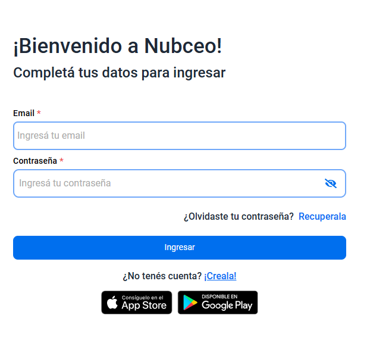

Esta plataforma es la que utiliza el cliente para ingresar a su cuenta y poder observar sus ingresos diarios, impuestos mensuales, liquidaciones, ventas y gastos.

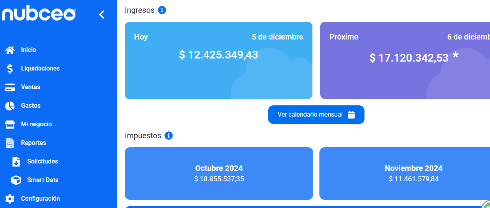

**Desde CX** utilizaremos esta página para ingresar a la cuenta del cliente y descargar el reporte ( planilla de excel), con determinado período de fecha y procesadora de pago, que necesitemos analizar.

El usuario siempre será el siguiente correo espejo+tXXX@nubceo.com, al cuál solo debemos modificar el número de tenat (cliente) y la contraseña la obtendremos desde el admin panel, en el sector *usuario de consulta.* 

**Nubceo central Manager**

Link: <https://techmgmt.internal.nubceo.com/admin/login?redirect=/content/access_request>

**Usuario** <XXXX@nubceo.com>

**Contraseña** (debemos crear una)

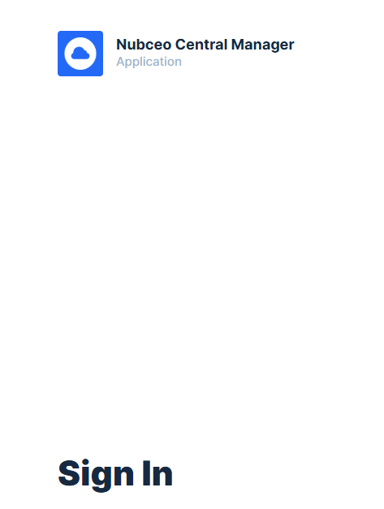

Esta página la utilizaremos para solicitar al equipo de tecnología los **accesos** a las distintas plataformas que usamos diariamente.

Una vez dentro de la página, solicitaremos el permiso 

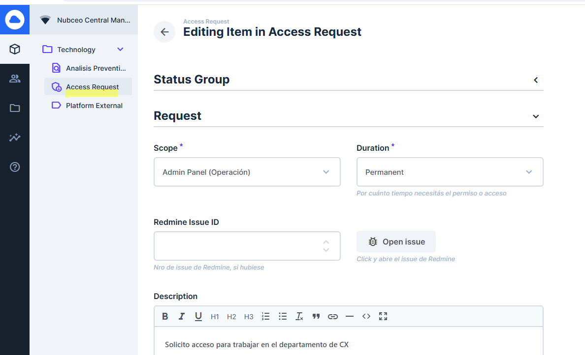

Luego debemos aguardar que nos otorguen el mismo.

Cuando el request status se encuentra en “GRATED”, esto nos confirma que ya está ok y nos enviarán a nuestra cuenta de gmail de nubceo el link para ingresar y junto con la contraseña que luego debemos modificar.

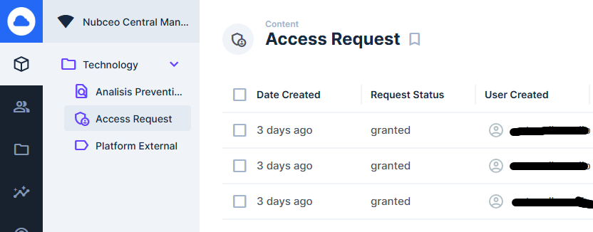

Ejemplo de acceso confirmado a REDMINE:

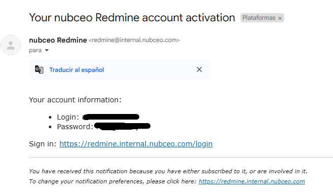

**Admin panel**

Link: <https://adminpanel.nubceo.com/login>

Para **ingresar** a la misma debemos solicitar acceso a <nico.costa@nubceo.com> , una vez que nos dé el alta, te llegará un correo al gmail de nubceo para que puedas restablecer tu contraseña.

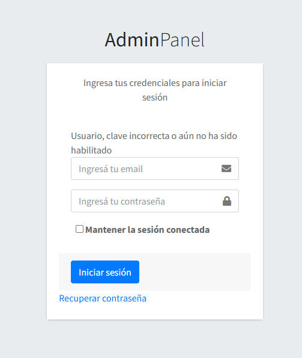

Esta plataforma nos permitirá realizar ciertas acciones tales como:

- **Contraseña Nubceo**

Este apartado lo utilizaremos para blanquear la contraseña del cliente, es decir, cuando un cliente nos informa que se ha olvidado la misma o no puede ingresar al portal.

Ponemos el número de Tenant y creamos una contraseña, ejemplo NUBCEO2024, luego damos click en actualizar y procedemos a informar al cliente. Le pedimos luego que cambie la misma por seguridad.

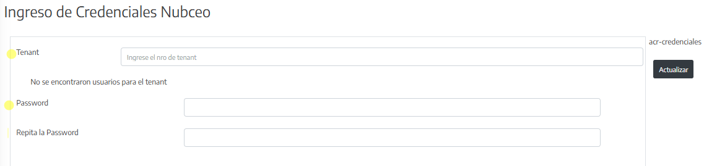

- **Subscribir o cambiar el plan**

Una vez que tenemos el *trato ganado o baja del contrato* y tenemos el *número de Tenant*, nos dirigiremos para activar esa cuenta.





- **Extender Trials**

Cuando el cliente ingresa con un período de prueba y desea extender el mismo, debemos dirigirnos al siguiente apartado, indicar número de Tenant y fecha que finalizará su prueba.

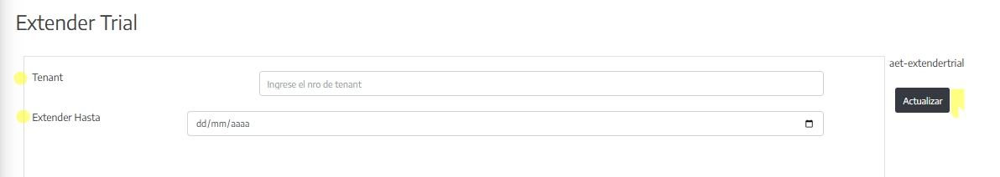

- **Escrapeo**

Es forzar de forma manual la extracción de datos de un cliente, procesadora de pago y período determinado.

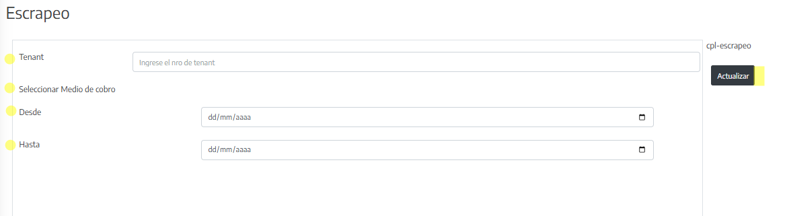

También tenemos la opción de programar el escrapeo.

- **Usuario de Consulta**

Nos permite, con el número de tenant del cliente ( buscar el mismo en la plataforma PIPE, si no te lo acuerdas), obtener una contraseña que se envía a tu correo de gmail de Nubceo y así entrar a la cuenta espejo en la plataforma NUBCEO CASH.

ACCIONES -\> USUARIO DE CONSULTA

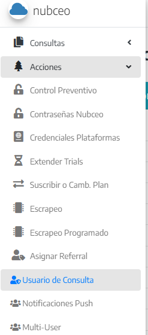

Te debe de llegar un correo como el siguiente al gmail personal de Nubceo.

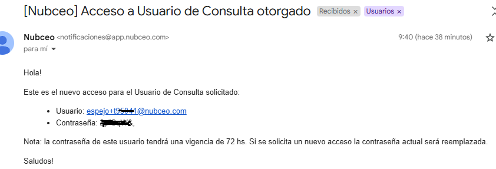

- **Desbloquear usuario de consulta**

Cuando un cliente nos contactó porque no puede ingresar a su plataforma, **debemos de solicitarle el correo que utiliza para ingresar.**

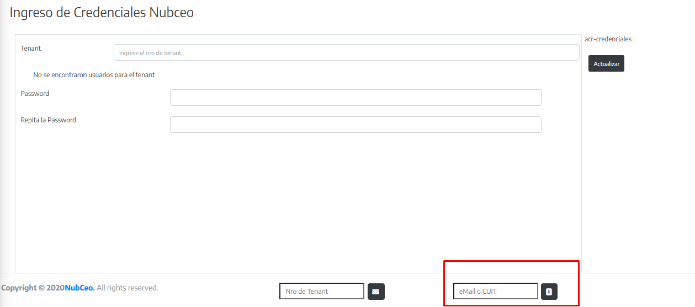

Ingresamos el correo en el siguiente casillero y nos figura luego información tal como su número de Tenat.

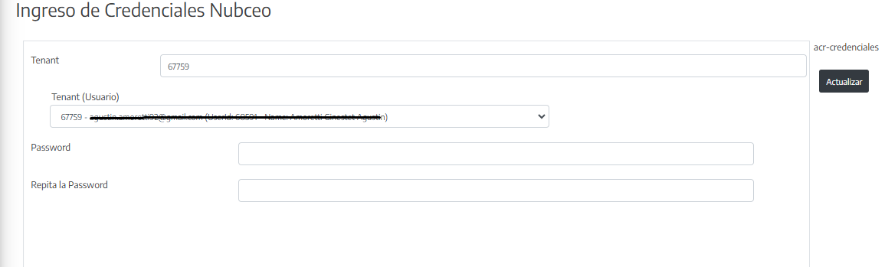

Hacemos click en actualizar.

Luego le consultamos al cliente si desea que le blanqueamos la contraseña.

De ser un sí, nos dirigimos a la pestaña **Contraseña Nubceo** (explicación más arriba).

**sdPipedrive**

Link: 

<https://nubceo.pipedrive.com/auth/login>

**Usuario:** <al@nubceo.com>

**Contraseña**: NUBCEO2024

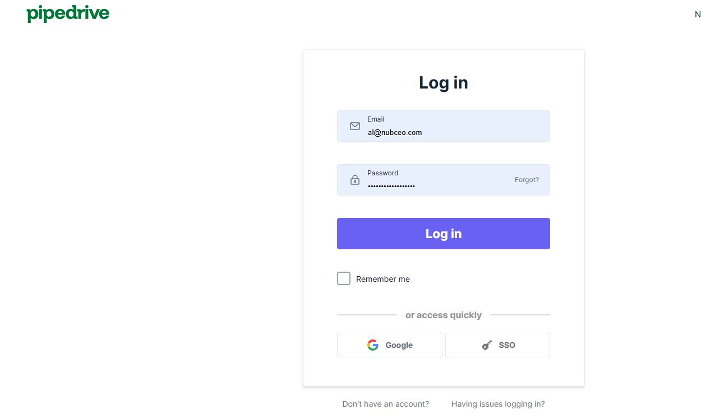

Este CRM lo utilizaremos para:

- Buscar el número de tenant del cliente en caso de que no lo recordemos.

- Ingresar al tenant del cliente y dejar información asentada en cada oportunidad que nos comuniquemos con el mismo.

En la siguiente imagen podrán observar que por ejemplo, no se recordaba el número de tenant del cliente “Yaguar”, por lo que se ha escrito la palabra en el buscador.

El tenant es el NÚMERO que figura en el recuadro rojo, siempre se encuentra del lado izquierdo del nombre del cliente y debe tener la etiqueta de GANADO.

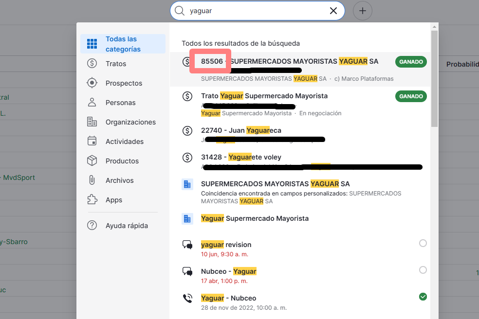

Al ingresar podemos ver en detalle la información del cliente.

En la parte de NOTAS, debemos de poner nuestras iniciales (nombre - apellido), y a continuación <u>escribir un breve resumen de la problemática que nos ha comunicado el cliente vía correo electrónico y/o whatsapp</u>, o problemas que hemos detectado al realizar el análisis de información semanal. Esto se debe realizar cada vez que tenemos contacto con el mismo.

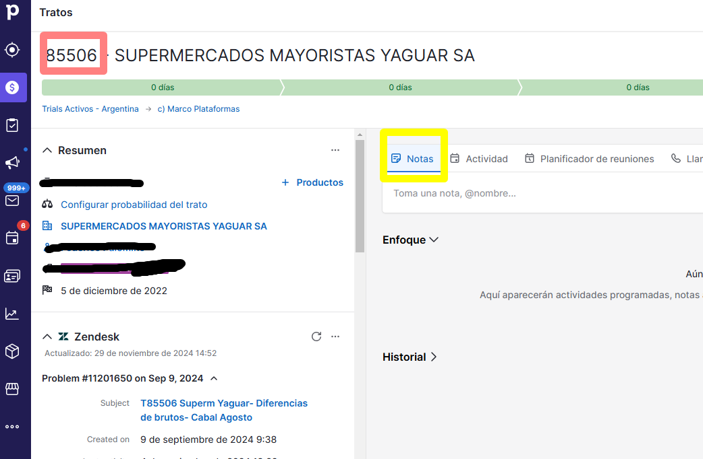

**Zendesk**

Link: <https://nubceosupporthelp.zendesk.com/agent/dashboard> 

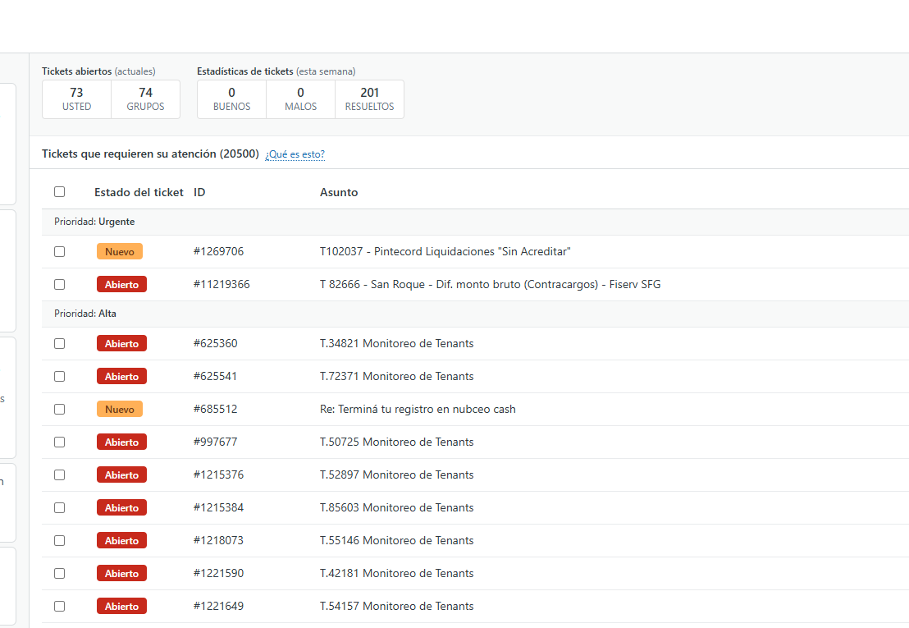*\*Imagen general sobre cómo se ve al iniciar sesión.*

Utilizaremos esta plataforma para generar un reporte sobre una problemática puntual, previo análisis realizado **(buscar la pestaña con explicación correspondiente en FUNCIONES CX -\> TAREAS A REALIZAR -\> PROCEDIMIENTO -\> REPORTE)**

Este reporte pasará al equipo de QA y/o DEV, quienes evaluarán la misma.

Para completar el reporte debemos dirigirnos a la pestaña de <u>REDMINE</u>.

1. **Como armar reporte en Zendesk**

Una vez que ingresamos a la plataforma, debemos armar el ticket en Zendesk.

Esto se hace en dos pasos ya que solo Redmaine nos permite adjuntar imágenes y archivos.

<u>Datos a completar sobre el margen izquierdo</u>

**Solicitante:** colocar el Número de T y elegir uno de los contactos que figuran al desplegarse ( es igual elegir cualquiera) 



<u>Agente Asignado</u>



<u>Prioridad y Número de Tenant</u>: en prioridad se coloca la opción que corresponda de acuerdo a la urgencia de resolución del problema. En Tipo **siempre ponemos PROBLEMA.**

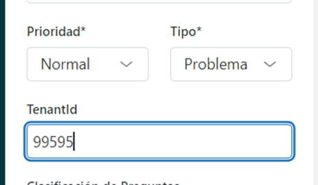

<u>From Customer</u>: se tilda si el cliente está haciendo algún tipo de reclamo



<u>Plataforma</u>: elegir la plataforma que se está reportando

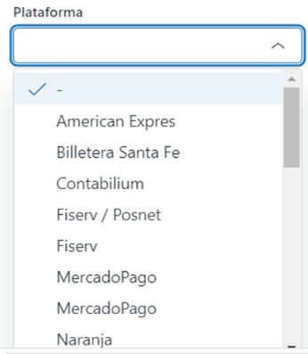

<u>Reportado por</u>: elegir la opción que corresponde. Por lo general cuando es Control preventivo se coloca Team CX, pero si es From Customer se coloca Cliente



<u>País</u>: seleccionar el país al que pertenece el Tenant.

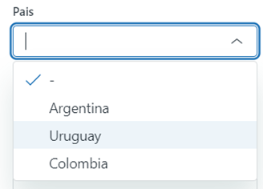

<u>Estado en Redmine:</u> siempre tildar NEW porque de lo contrario no viajará el ticket a Redmine.



<u>Usuario:</u> seleccionar el nombre de quien reporta

<u>Modelo de título</u>

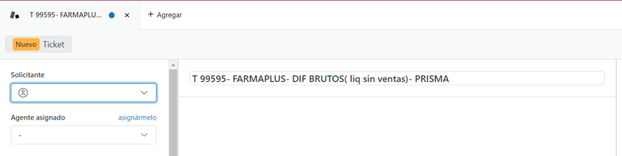

**ATENCIÓN!!** <u>SIEMPRE</u> COLOCAR NOTA INTERNA, de lo contrario se le enviará el reporte de error al cliente.

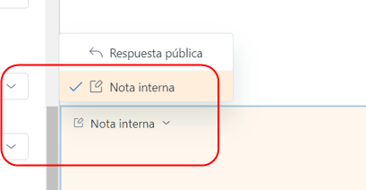

**A continuación se copia el reporte respetando la plantilla y asegurándose de completar todos los datos que solicita.**

Por último enviar como <u>EN ESPERA</u> para que envíe el ticket a Redmine , de lo contrario no migrara.

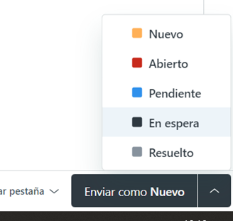

2. **Plantilla de Reporte de Zendesk**

En el recuadro de NOTA INTERNA, utilizamos la siguiente plantilla a completar.

**Redmine**

Link: <https://redmine.internal.nubceo.com/login?back_url=https%3A%2F%2Fredmine.internal.nubceo.com%2Fmy%2Fpage>

**Usuario** <XXXX@nubceo.com>

**Contraseña** (debemos crear una)

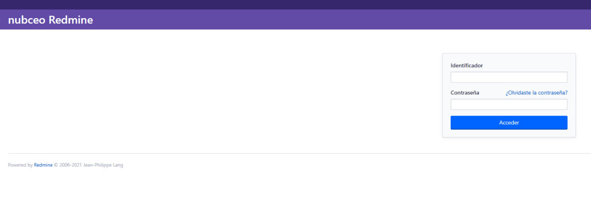

Una vez que hayamos solicitado en <u>Nubceo central Manager</u> el acceso, nos enviarán un correo electrónico al gmail de nubceo personal, donde nos otorgan nombre de usuario y contraseña, ésta última debemos modificarla.

Redmine la utilizaremos como complemento de ZENDESK para adjuntar archivos e imágenes correspondientes al *REPORTE* que hemos iniciado en la plataforma recientemente mencionada.

**IMPORTANTE** : Requerimientos de cada tipo de tarea 

<https://redmine.internal.nubceo.com/projects/nubceo-client/wiki/Requerimentos_de_cada_tipo_de_tarea_de_Redmine>

**Discord**

Link: https://discord.com/

Debes crear un usuario y contraseña con tu correo personal ( no de nubceo).

Utilizamos esta aplicación para comunicarnos entre empleados de la empresa.

Existen *células* de grupos específicos que utilizamos para comunicarnos con todos los equipos y nos ayuda a resolver consultas e intercambiar información.

---

### OCR de imágenes

> **OCR:**
>
> ¡Bienvenido a Nubceo!
> Completá tus datos para ingresar
> 
> Email *
> 
> Contraseña *
> 
> Ihw…f_íu ntraseña N
> 
> ¿Olvidaste tu contraseña? Recuperala
> 
> Ingresar
> 
> ¿No tenés cuenta? ¡Creala!

> **OCR:**
>
> Suscribir o cambiar de plan
> 
> Tenant
> 
> 108571
> 
> Q Cash Comercio
> CO Cash Delivery
> 
> © Cash Cancelled
> @ ash Thal días
> (© Cash Contador
> 
> Plan actual:CASH_TRIAL_7
> 
> asu-suspender

> **OCR:**
>
> Extender Trial
> 
> @ Tenant Ingrese el nro de tenant
> 
> "Extender Hasta ‘dd/mm/aaaa o

> **OCR:**
>
> Escrapeo
> 
> @ Tenant Ingrese el nro de tenant
> 
> Seleccionar Medio de cobro
> 
> ©) Desde
> 
> dd/mm/aaaa
> 
> @ Hasta dd/mm/aaaa

> **OCR:**
>
> & nubceo
> 
> Consultas <
> Acciones v
> Control Preventivo
> Contraseñas Nubceo
> Credenciales Plataformas
> 
> Extender Trials
> 
> lo O D» E
> 
> Suscribir o Camb. Plan
> Escrapeo
> 
> Escrapeo Programado
> 
> Asignar Referral
> o Usuario de Consulta
> 423 Notificaciones Push
> 
> 48 Multi-User

> **OCR:**
>
> [Nubceo] Acceso a Usuario de Consulta otorgado Fetitidos x Usuarios x
> 
> Nubceo «notificacionesEapp.nubceo.com> 9:40 (hace 38 minutos)
> para mi »
> 
> Holal
> Este es el nuevo acceso para el Usuario de Consulta solicitado:
> 
> « Usuario: espejo+t968<1 @nubceo.com
> « Contrasefia: aua
> 
> Nota: la contrasefia de este usuario tendrá una vigencia de 72 hs. Si se solicita un nuevo acceso la contraseña actual sera reemplazada.
> 
> Saludos!
> 
> Le
> 
> *

> **OCR:**
>
> Ingreso de Credenciales Nubceo
> 
> Tenant
> 
> No se encontraron usuarios para el tenant
> 
> Password
> 
> Repita la Password
> 
> Copyright © 2020NubCeo. All rights reserved.
> 
> Nro de Tenant
> 
> eMail o CUIT
> 
> acr-credendiales

> **OCR:**
>
> Ingreso de Credenciales Nubceo
> 
> acr-credenciales
> 
> Tenant p
> Tenant (Usuario)
> 7759 - espimamesol oo ) v
> Password
> 
> Repita la Password

> **OCR:**
>
> pipedrive
> 
> Login
> 
> Email
> 
> ‘al@nubceo.com
> 
> a Forgot?
> 
> Remember me
> 
> or access quickly
> 
> G Google $ sso
> 
> Don't have an account? — Having issues logging in?

> **OCR:**
>
> Todas las
> categorías
> 
> Tratos
> Prospectos
> Personas
> Organizaciones
> Actividades
> Productos
> Archivos
> 
> Apps
> 
> Ayuda rápida
> 
> Todos los resultados de la busqueda
> 
> e
> 
> ©
> 
> 85506 | SUPERMERCADOS MAYORISTAS YAGUAR SA
> —
> 
> SUPERMERCADOS MAYORISTAS WAGUAR SA - c) Marco Plataformas
> 
> Trato Vaguar Supermercado Mayorista
> —;],;.;]_—U]]];—
> 
> Maguat Supermercado Mayorista - En negociación
> 
> 22740 - Juan Vaguafeca
> _
> 
> 31428 - Vaguarete voley
> /
> 
> SUPERMERCADOS MAYORISTAS VAGUAR SA
> Coincidencia encontrada en campos personalizados: SUPERMERCADOS
> 
> MAYORISTAS VAGUAR SA
> Yaguat Supermercado Mayorista
> Vaguar revision
> 
> Nubceo - Yaguar
> 
> Vaguat - Nubceo
> 28 de nov de 2022, 10:00 a. m.

> **OCR:**
>
> Tratos
> 
> SUPERMERCADOS MAYORISTAS YAGUAR SA
> 
> O días Odias O dias
> Trials Activos - Argentina > c) Marco Plataformas
> 
> A Resumen .
> El actividad
> 
> + Productos
> Toma una nota, @nombre
> 68 Configurar probabilidad del trato
> 
> Planificador de reuniones — K Liar
> 
> El SUPERMERCADOS MAYORISTAS YAGUAR SA
> 
> — — EOq
> 
> s — 0
> Fal 5 de diciembre de 2022 ‘Aqui aparecerán actividades programadas, notas
> “A %Z Zendesk c
> 
> Actualizado: 29 de noviembre de 2024 14:52 chee
> 
> Problem #11201650 on Sep 9, 2024 »
> 
> Subject T85506 Superm Yaguar- Diferencias
> de brutos- Cabal Agosto
> 
> Crestedon 9 de septiembre de 2024

> **OCR:**
>
> Ingresos
> 
> Próximo
> 
> $17.120.342,53 *
> 
> Impuestos

> **OCR:**
>
> Tickets abiertos (actuales) Estadisticas de tickets (esta semana)
> 
> 73 74 0 0 201
> USTED GRUPOS BUENOS MALOS — RESUELTOS
> 
> Tickets que requieren su atención (20500) ¿Qué es esto?
> 
> ( Estado del ticket ID Asunto
> 
> Prioridad: Urgente
> 
> 0 as #1269706 102037 - Pintecord Liquidaciones “Sin Acreditar"
> Oo 411219366 T 82666 - San Roque - Dif. monto bruto (Contracargos) - Fiserv SFG
> Prioridad: Alta
> 
> Oo #625360 1.34821 Monitoreo de Tenants
> 
> Oo #625541 1.72371 Monitoreo de Tenants
> 
> 0 as #685512 Re: Terminá tu registro en nubceo cash
> 
> Oo #997677 1.50725 Monitoreo de Tenants
> 
> Oo 41215376 T.52897 Monitoreo de Tenants
> 
> Oo #1215384 1.85603 Monitoreo de Tenants
> 
> Oo #1218073 1.55146 Monitoreo de Tenants
> 
> Oo #1221590 1.42181 Monitoreo de Tenants
> 
> Oo #1221649 1.54157 Monitoreo de Tenants

> **OCR:**
>
> Solicitante
> 
> »
> 
> Alejandro Cossi
> acossi@farmaplus.co
> mar
> 
> Laura Cordoba
> Imcordoba@farmaplu
> s.com.ar
> 
> Ignacio Rostan
> 
> irostan@farmaplus.co
> maar
> 
> Sofia Correa

> **OCR:**
>
> Agente asignado asignármelo
> 
> < Grupos
> 
> (0) Asignar a Team CX
> 
> Team CX
> 
> rormurario

> **OCR:**
>
> Prioridad* Tipo*
> 
> Normal — < Problema <
> 
> Tenantid

> **OCR:**
>
> From Customer

> **OCR:**
>
> Plataforma
> 
> J
> American Expres
> Billetera Santa Fe
> Contabilium
> Fiserv / Posnet
> Fiserv
> MercadoPago
> MercadoPago
> 
> Naranja

> **OCR:**
>
> Reportado Por
> 
> Y Cliente
> Team Cx
> Sales
> 
> AdminPanel

> **OCR:**
>
> Argentina
> 
> Uruguay
> 
> Colombia

> **OCR:**
>
> Estado en Redmine*
> 
> No corresponde reportar
> Y New
> Pending Definition
> Resolved
> Deployed Live
> Cancelled
> Closed / Finished
> Others “

> **OCR:**
>
> (RRB) Ticket
> 
> Soliitante
> 
> ‘Agente asignado asignármeto
> 
> T 99595- FARMAPLUS- DIF BRUTOS( liq sin ventas)- PRISMA

> **OCR:**
>
> B Nubceo Central Manager
> 
> Sign In

> **OCR:**
>
> Respuesta pública
> 
> Y © Nota interna
> 
> © Nota interna -

> **OCR:**
>
> ® Nuevo
> @ Abierto
> M Pendiente
> 
> M Enespera
> 
> B Resuelto

> **OCR:**
>
> nubceo Redmine
> 
> Identificador
> 
> Contraseña ¿Olvidaste la contraseña?
> 
> Powered by Redmine © 2006-2021 Jean-Philippe Lang

> **OCR:**
>
> E @ Nubceo Central Man...
> < Editing Item in Access Request
> 
> Q (© Technology v
> 
> Analisis Preventi...
> 
> Status Group
> Y pomninar
> D Platform External
> Request
> Scope* Duration *
> Admin Panel (Operacién) Permanent
> 
> Redmine Issue ID
> 
> #% Openissue
> 
> Description
> 
> Brum wi it hk sw a@— © oF
> 
> Solicito acceso para trabajar en el departamento de CX

> **OCR:**
>
> Y Nubceo Central Man...
> @ Access Request
> 
> Q (© Technology v
> 
> Analisis Preventi... Date Created Request Status
> 
> @ Access Request
> 
> 3 days ago granted
> D Platform External
> 
> 3 days ago granted
> 
> 3 days ago granted
> 
> User Created
> 
> —
> —

> **OCR:**
>
> Your nubceo Redmine account activation Pistsformas x
> 
> nubceo Redmine <redmine@internal.nube
> para y
> 
> Eg Traducir al español x
> 
> Your account information:
> 
> Sign in: https://redmine.internal.nubceo.com/login
> 
> You have received this notification because you have either subscribed to it, or are involved in it.
> To change your notification preferences, please click here: httos://redmine.intemal.nubceo.com

> **OCR:**
>
> AdminPanel
> 
> Ingresa tus credenciales para iniciar
> sesión
> 
> Usuario, clave incorrecta o atin no ha sido
> habilitado
> 
> Ingresá tu email z
> 
> Ingresá tu contraseña a
> 
> O Mantener la sesión conectada
> 
> Iniciar sesión
> 
> Recuperar contraseña

> **OCR:**
>
> Ingreso de Credenciales Nubceo
> 
> OpTenant Ingrese el nro de tenant
> 
> No se encontraron usuarios para el tenant
> 
> — Password
> 
> Repita la Password
> 
> acr-credendiales

> **OCR:**
>
> & nubceo
> 
> IB consultas
> 
> & Acciones
> 
> & Control Preventivo
> d Contraseñas Nubceo
> Credenciales Plataformas
> E Extender tials
> 
> = Suscribiro Camb. Plan
> ME Escrapeo
> 
> ME Escrapeo Programado
> e Asignar Referral
> 
> So Usuario de Consulta
> 
> Notificaciones Push
> 
> Multi-User
> 
> n gene
> 
> All rights reser