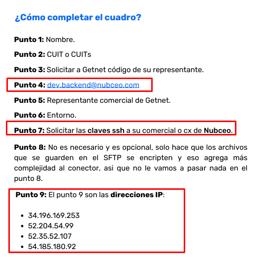
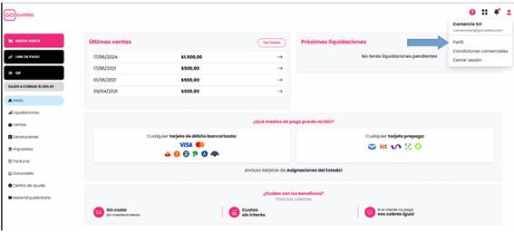
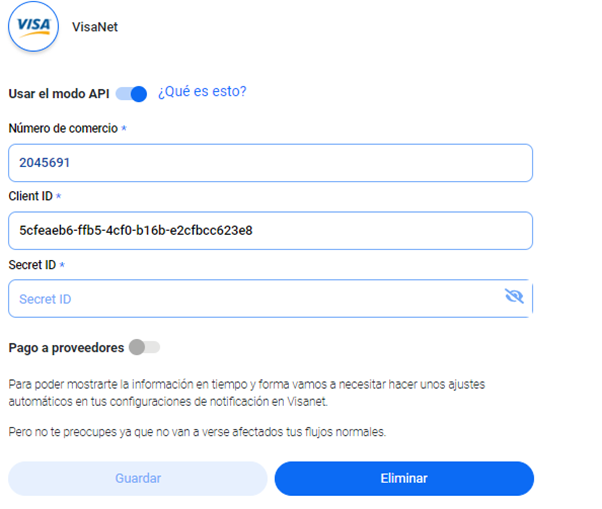
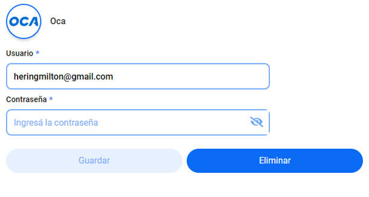
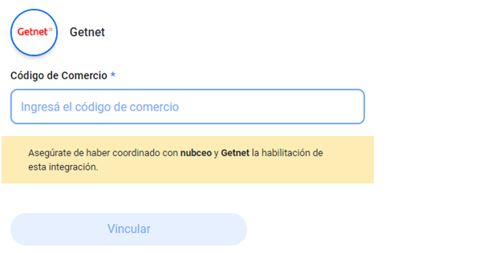
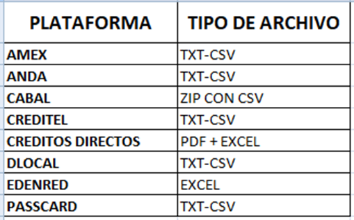
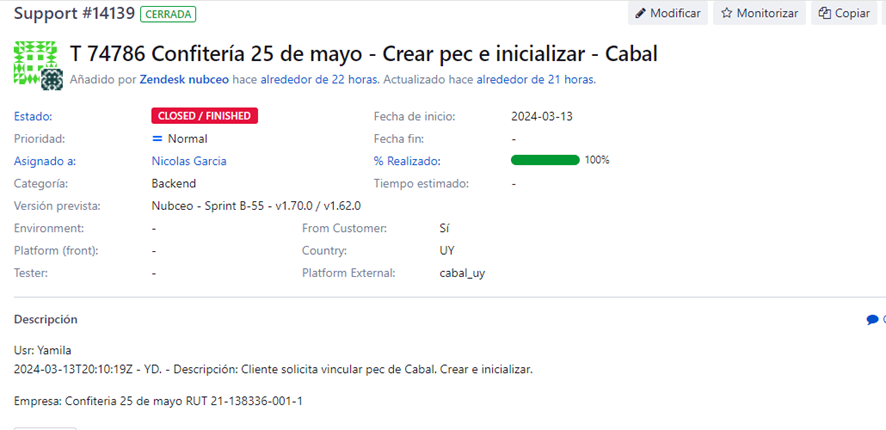
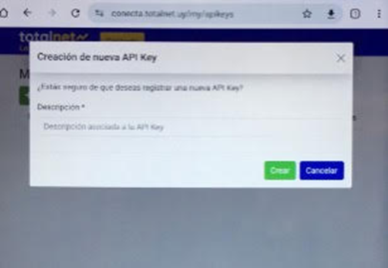

**ARGENTINA**

1. Mercado pago → API

<!-- -->

1. Amex → SFTP

<!-- -->

1. [Naranja](https://docs.google.com/document/u/0/d/1DugatAEMwaIXfX7aLSVJLMc5cJGvsHN0/edit) → PORTAL ([INFO IMPORTANTE](https://docs.google.com/document/d/1Cs9Ds06B4_JrJ25_vrA0zHOWT6kYGKkKKd_i9ACz2CQ/edit?tab=t.0) )

<!-- -->

1. [Cabal](https://drive.google.com/open?id=1eUESOiG7KNIuISeUCZjCwb0UGMRjnSSC) → SFTP

<!-- -->

1. [Prisma](https://drive.google.com/open?id=1y5xGcQydmrZgf4qOhhGKmixCOqtIrExK) → Movipagos/PrismaNet o SFTP

<!-- -->

1. [Fiserv](https://docs.google.com/presentation/u/0/d/1jWA742LAquaVZY_SpBW4cIr_tCp6tixp/edit) → SFG

<!-- -->

1. Pedidosya → PORTAL

<!-- -->

1. [Rappi](https://drive.google.com/open?id=1i4J_bD6eLyD3K_oXCo0oV7mTOHzRxJLq) → PORTAL

<!-- -->

1. Go Cuotas → API 

<!-- -->

1. Getnet → GMR

TENEMOS PDF DE GO CUOTAS Y GETNET, agregar

**URUGUAY**

1. [Edenred](https://drive.google.com/open?id=1mbKKrBFXr9CGAF1R-nLNE0x3bc63iZTY) mail

<!-- -->

1. Passcard mail

<!-- -->

1. [Anda](https://drive.google.com/open?id=1mbKKrBFXr9CGAF1R-nLNE0x3bc63iZTY) mail

<!-- -->

1. [Créditos directos](https://drive.google.com/open?id=1mbKKrBFXr9CGAF1R-nLNE0x3bc63iZTY)

<!-- -->

1. Creditel 

<!-- -->

1. TotalNet → API

<!-- -->

1. [Oca](https://drive.google.com/open?id=1rwdo-ZI9EZgD5iogTUQ9WE05zdoAcoPy) API

<!-- -->

1. Getnet → API

<!-- -->

1. Fiserv → SFG

**INSTRUCTIVO PARA VINCULAR PROCESADORAS DE PAGO A NUBCEO**

**Fiserv (FTP):**

Para solicitar el alta del **SFG de Fiserv,** deben de hacerlo mediante un sistema de tickets que ofrece el merchant nuevo de Fiserv. Les dejo los pasos a continuación para que no tengan inconvenientes. Una vez dado de alta el ticket solicitamos que nos transmitan el número del ticket e informarnos el nombre y CUIT de cada razón social por la que abrieron un ticket (es un ticket por cada razón social) 

- En el merchant nuevo, en el menú que se encuentra en la parte inferior izquierda donde dice "AYUDA".

- Dentro de "ayuda" van a tener la opción de "NUEVO TICKET".

- En el momento que le den a nuevo ticket, se les va a desplegar un menú de opciones.

- En ese menú selecciona la opción que es "ALTA SFG".

- Una vez seleccionado, completan los campos con los datos solicitados y por último seleccionan "enviar"

Cuando nos envíen el mismo, ingresamos a nubceo cash con la cuenta espejo, nos dirigimos a la parte **mi negocio, hacemos click en gestionar y agregamos medio de cobro FISERV**

Debemos completar con:

- **US:** ( usuario que nos envía el cliente)

- **Pass:** ( contraseña que nos envía el cliente)

- **URL:** **prod2-gw-lac.firstdataclients.com** (SIEMPRE USAMOS EL MISMO URL)

- **PUERTO:** **6522** (SIEMPRE USAMOS EL MISMO PUERTO)

**Mercado Pago (API):** 
*Importante: previo a vincular Mercadopago, es indispensable abrir en una pestaña aparte, la cuenta administradora que se vaya a vincular de Mercado Libre.*

1. Abrir la cuenta de Nubceo

2. Dirigirse a la sección de Mi Negocio 

3. Seleccionar la razón social y desplazarse hacia abajo 

4. Vincular un nuevo medio de cobro

5. Seleccionan Mercado Pago pero aún **NO PONEN VINCULAR**

6. Previamente, se debe abrir en una pestaña aparte la cuenta administradora de MercadoPago que corresponda a esa razón social que se vaya a vincular.

7. Una vez hecho esto, vuelven a nubceo y selecciona VINCULAR la procesadora de Mercado Pago

8. Los redirigirá a una pestaña de Mercado Libre donde deberán aceptar los términos y condiciones

9. Y listo, una vez vinculada correctamente la plataforma, aparecerá un cartel que indica que la vinculación fue realizada con éxito.

**Naranja (Portal):**

- Abrir la cuenta madre (cuenta administradora) de Naranja 

- Dirígete a la sección de ***Tu negocio*** 

- En esta sección vas a ver tu equipo de trabajo. 

- Para agregar Nubceo tenes que hacer click en ***invitar a una persona***

- En la opción de Permisos tildar:

 - Ventas liquidaciones y conciliaciones 

 <!-- -->

 - Números de comercios y planes de financiación

 <!-- -->

 - Ventas desconocidas 

 <!-- -->

 - Una vez realizado todo esto tenes que agregar el mail a asociar <pec_xxx@asistente.nubceo.com> (poner el mail indicado en la plataforma Nubceo) 

 - Nombre → Nubceo

 - Apellido → Nubceo 

- Si ves el mensaje *“¡Muy bien! Nubceo Nubceo ya es parte de tu equipo”* significa que la vinculación fue ¡exitosa!

**Cabal SFTP: **

Para solicitar el acceso SFTP, contactar a transmisiones@cabal.coop y solicitarle que te comparta las credenciales para el SFTP.

Te compartirán un link de ingreso, un usuario y una contraseña, con la misma deberás ingresar a la web indicada de link y cambiar la misma.

<https://transmisiones.cabal.coop/webclient/Login.xhtml>

**Payway SFTP:**

Los clientes deben de ingresar a Nubceo ,**mi negocio, hacemos click en gestionar y agregamos medio de cobro Prisma, hacer click en SFTP, completar el cuit e iniciar vinculación y obtenemos la LLAVE PÚBLICA.**

Luego ingresar a payway <https://mi.payway.com.ar/ms/ui-login/login>, deben de tener My Payway Profesional <u>organizar una meet de no más de 10 minutos para realizar la programación de reportes.</u>

Prisma, para la conexión SFTP se requiere que tengan my Payway Profesional, si cuentan con el mismo solo debemos programar un meet de no más de 10 minutos para programar en conjunto los reportes.

Una vez que la conexión a Payway Profesional esté activa en Nubceo, podrán acceder a información mucho más detallada y precisa, sin interrupciones, incluyendo:

- CFT discriminado por cupón

- Identificación de BINs

- Ventas QR

- Proyecciones de cobro

- Información robusta para facilitar la conciliación

Creemos que esta mejora será clave para optimizar su experiencia con la herramienta, sobre todo si en el futuro evalúan incorporar el módulo de conciliación. 

Si no poseen profesional puede solicitar acceso a Movypagos, es gratuito para todos los clientes de Payway y permite una conexión más estable que el portal tradicional. Sin embargo, tiene ciertas limitaciones: no incluye información sobre ventas QR, proyecciones de cobro ni los BIN de las tarjetas.

**Amex SFTP:**

Deben de completar el siguiente formulario adjunto, <u>debe de completarse uno por cuit</u>. Enviarnos los mismos para que así podamos enviarlo a Amex y comenzar a gestionar la conexión. 

Te dejo puntos a tener en consideración a la hora de completarlo:

- En el formulario adjuntar <u>todo el detalle de números de establecimiento</u> que tengan asociados con Amex

- Empresa conciliadora: NUBCEO

- Formato de Archivos: TAB

- Protocolo de Comunicación: SFTP

El resto de casillas deben completarlo con sus datos.

Luego desde Amex, a los 10 aproximadamente, le enviarán un correo con el usuario y otro con la contraseña por cada cuit, le solicitamos que nos envíen los mismos para vincular a Nubceo.

—

Cuando nos envíen el mismo, ingresamos a nubceo cash con la cuenta espejo, nos dirigimos a la parte **mi negocio, hacemos click en gestionar y agregamos medio de cobro Amex, tildamos el FTP**

Debemos completar con:

- **US:** ( usuario que nos envía el cliente)

- **Pass:** ( contraseña que nos envía el cliente)

[FORMULARIOS DE AMEX](https://drive.google.com/drive/folders/1U-FSH8GjZFIH56i6T2Z0l71kJ57HsviY) 

**Getnet:**

Los clientes deben de ingresar a Nubceo ,**mi negocio, hacemos click en gestionar y agregamos medio de cobro Getnet, iniciar vinculación y obtenemos la LLAVE PÚBLICA.**

Luego el cliente debe de comunicarse con GETNET, solicitar el alta de GMR y completar los datos que le solicitan con sus propia información, de Nubceo solo debe de rellenar



Instructivo primer sola de procesadoras de pago

**GoCuotas:**

- Ingresá al Panel de Administrador.

- Verificá que esté la opción "Liquidaciones" en el menú de la izquierda.

- Hacé clic en el perfil de usuario (arriba a la derecha).



 

- Desplázate hasta el final para ver las **API Keys**.

- Hacé clic en ellas y se abrirá una pestaña con la información.

- Enviá esas API Keys por mail a **team.cx@nubceo.com**, indicando tu **número de cliente y nombre**.

**PedidosYa (Portal)**

Debido a la doble autenticación que ha desarrollado la procesadora. Es necesario generar un usuario (con los correos que mencionamos más abajo) y contraseña para cada uno de los Cuits que posea el cliente. Una vez generado el usuario en el portal de Pedidos ya , se deberá vincular el usuario en Nubceo .

Formato del mail : <pec_xxxx@asistente.nubceo.com>

**Rappi (Portal)**

Debido a la doble autenticación que ha desarrollado la procesadora. Es necesario generar un usuario (con los correos que mencionamos más abajo) y contraseña para cada uno de los Cuits que posea el cliente. Una vez generado el usuario en el portal de Rappi, se deberá vincular el usuario en Nubceo .

 Formato del mail : pec_xxxx@nubceo.com

**Visanet:**

- Anteriormente contábamos con la vinculación por número de comercio, usuario y contraseña.

- **En la actualidad la vinculación es por medio de API**



El cliente deberá solicitar este acceso a Visanet para que ellos nos brinden el Client ID y Secret ID que luego se completa en la app, tal como muestra la imagen. (Detallo al final es el proceso)

**Oca:**

- La vinculación consta de agregar usuario y contraseña en la app para la correcta registración.



**Getnet:**

- El cliente debe solicitar a Getnet el acceso por Api. (Detallo al final es el proceso)

- Getnet le responde indicando un número de comercio que luego vinculamos en nubceo:



**Procesadoras chicas como Anda, PassCard, Creditel, etc:**

- Primero es necesario que el cliente valide el formato en el que recibe el archivo. Para esto deberá pedir a cada procesadora que se lo envíen en estos formatos:

Luego verificamos que el archivo coincida con el que actualmente procesamos para Arcos. Debe tener las mismas filas, columnas, información general. Para esto en general consultamos con tecnología.

En caso que el formato lo procesemos se carga un issue similar este para pedir que se cree la pec en nubceo. 



Posterior se le brinda al cliente el mail pec creado, el cual deberá configurar con la procesadora correspondiente a fin de que podamos recibir este archivo de manera automática. 

**Pedido de acceso API – Visanet/Totalnet:**

Al cliente hay que solicitarle que ingrese al siguiente link: [**https://conecta.totalnet.uy**](https://conecta.totalnet.uy/) luego tiene que ir a la opción Login, allí ingresa con el mail y contraseña.

Luego a la derecha en el nombre del usuario arriba, va a tener una opción: **“Mis Api Keys Conecta”.** Ingresando allí podrán **“Crear”** nuevas credenciales. 

Le aparece Crear de esta manera:



Allí les va a mostrar la información de las credenciales para que puedan copiarlas y luego ingresarlas en nubceo.

**Importante**, deberán copiar el **"Cliente ID" y "Secret ID"** al momento que se generan ya que luego no se puede volver a visualizar el dato del “secret”.

---

### OCR de imágenes

> **OCR:**
>
> ¿Cómo completar el cuadro?
> 
> Punto 1: Nombre.
> Punto 2: CUIT o CUITs
> 
> Punto 3: Solicitar a Getnet código de su representante.
> 
> Punto 4: dev. backend@nubceo.com
> 
> Punto 5: Representante comercial de Getnet.
> 
> Punto 6: Entorno.
> 
> Punto 7: Solicitar las claves ssh a su comercial o cx de Nubceo.
> 
> Punto 8: No es necesario y es opcional, solo hace que los archivos
> que se guarden en el SFTP se encripten y eso agrega mas
> complejidad al conector, asi que no le vamos a pasar nada en el
> punto 8.
> 
> Punto 9: El punto 9 son las direcciones IP:
> 
> 34.196.169.253
> 52.204.54.99
> 52.35.52.107
> 54.185.180.92

> **OCR:**
>
> VisaNet
> 
> Usar el modo API E {Qué es esto?
> 
> Número de comercio +
> 
> 2045691
> 
> Client 1D +
> 
> | Scfeaebe-ffbs-4cf0-bieb-e2cfbec62968
> 
> Secret ID +
> 
> Secret ID N
> 
> Pago a proveedores @
> 
> Pere poder mostrarte l información en tiempo y forma vamos a necesitar hacer unos ajustes
> ‘autométicos en tus configuraciones de notificación en Visanet.
> 
> Pero no te preocupes ya que no van a verse afectados tus fujos normals.

> **OCR:**
>
> Oca
> 
> Usuario *
> 
> | heringmitton@gmail.com
> 
> Contrasefia *
> 
> | Ingresá la contrasefia
> 
> S
> 
> Guardar
> 
> Eliminar

> **OCR:**
>
> () cam
> 
> Código de Comercio *
> 
> I Ingresá el código de comercio
> 
> Vincular

> **OCR:**
>
> PLATAFORMA | TIPO DE ARCHIVO
> 
> AMEX TXT-CSV
> 
> ANDA TXT-CSV
> 
> CABAL ZIP CON CSV
> 
> CREDITEL TXT-CSV
> 
> CREDITOS DIRECTOS PDF + EXCEL
> 
> DLOCAL TXT-CSV
> 
> EDENRED EXCEL
> 
> PASSCARD TXT-CSV

> **OCR:**
>
> Support #14139 4 Modificar — %? Monitorizar
> %fg T 74786 Confitería 25 de mayo - Crear pec e inicializar - Cabal
> 
> Añadido por Zendesk nubceo hace alrededor de 22 horas. Actualizado hace alrededor de 21 horas.
> 
> Estado: ‘CLOSED / FINISHED Fecha de inicio: 2024-03-13
> Prioridad: Normal Fecha fin: -
> 
> Asignado a: Nicolas Garcia % Realizado: n
> Categoría: Backend Tiempo estimado: -
> 
> Versión prevista: Nubceo - Sprint B-55 - v1.70.0/v1.620
> 
> Environment: - From Customer: si
> 
> Platform (front): - Country: uy
> 
> Tester: - Platform External: cabal_uy
> 
> Descripción
> 
> Use: Yamila
> 
> 2024-03-13T20:10:197 - YD. - Descripción: Cliente solicita vincular pec de Cabal. Crear e inicializar.
> 
> Empresa: Confiteria 25 de mayo RUT 21-138336-001-1
> 
> E Copiar

> **OCR:**
>
> o
> 
> €
> 
> > C % comctascet re
> 
> Cresción de nueva API Key
> 
> (Patan »egaro Oe Que 9:5e23 INQUTD ane name AM boy
> Dunenpción *